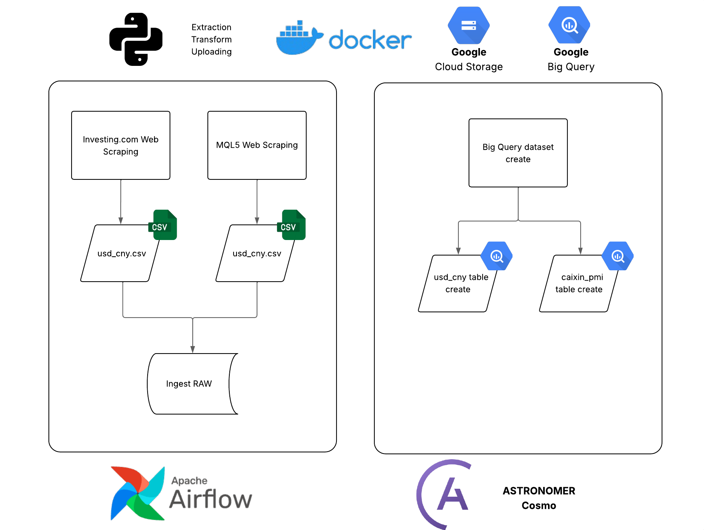

# Papers Pricing Data Pipeline

Automation project designed to collect, process, and store economic indicators from [Investing.com](https://br.investing.com) and other financial sources.

This pipeline extracts:
- **Historical USD/CNY (US Dollar/Chinese Yuan) exchange rate data** from Investing.com.
- **Historical Chinese Caixin Services PMI data** from MQL5.

Data is scraped, cleaned, and automatically loaded into a scalable cloud architecture using **Google Cloud Storage** and **BigQuery**, orchestrated by **Apache Airflow**.

---


## Tech Stack

| Layer           | Tool                      |
|-----------------|----------------------------|
| Orchestration   | Apache Airflow             |
| Web Scraping    | Request + Selenium + BeautifulSoup   |
| Cloud Storage   | Google Cloud Storage (GCS) |
| Database        | BigQuery                   |
| ETL Facilitator | Astro SDK                  |
| Containerization| Docker                     |

## How It Works




## Codes Explanation

### DAG: `papers`

This DAG orchestrates the entire data pipeline for collecting, storing, and processing USD/CNY historical data.

### Tasks:

- **fetch_and_upload**
  - Uses Selenium and BeautifulSoup to scrape the monthly USD/CNY data from Investing.com.
  - Saves the data as a CSV file inside the Airflow container.

- **upload_usd_cny_csv_to_gcs**
  - Uploads the locally saved CSV file to a specific path (`raw/usd_cny.csv`) in a Google Cloud Storage (GCS) bucket.

- **create_papers_dataset**
  - Creates a BigQuery dataset named `papers` if it does not already exist.

- **papers_gcs_to_raw**
  - Loads the CSV file from GCS into a BigQuery table called `usd_cny_monthly` using Astro SDK.

---

### DAG: `caixin_pmi`

This DAG orchestrates the data pipeline for Caixin PMI data.

### Tasks:

- **fetch_and_upload**
  - Scrapes monthly Caixin Services PMI historical data from the MQL5 website.
  - Parses the data with BeautifulSoup.
  - Creates a clean CSV file locally inside the Airflow container.

- **upload_csv_to_gcs**
  - Uploads the generated CSV file to a GCS bucket under `raw/caixin_pmi.csv`.

- **create_papers_dataset_if_not_exist**
  - Ensures that a dataset named `papers` exists in BigQuery.

- **papers_gcs_to_raw**
  - Loads the CSV file from GCS into BigQuery into the `caixin_pmi_monthly` table using Astro SDK.


---
## To run this project you must.

## Install Astro CLI

- Installation
1. Open Windows PowerShell as an administrator and then run the following command:
```bash
winget install -e --id Astronomer.Astro
```
2. Run to confirm the Astro CLI is installed properly.
```bash
astro version
```
https://www.astronomer.io/docs/astro/cli/install-cli/?tab=windowswithwinget#install-the-astro-cli

## Install Docker
https://www.docker.com/products/docker-desktop/

## Clone the GitHub Repository

In your terminal:

Clone the repository using Github CLI or Git CLI

```bash
git clone https://github.com/lyipef/papers-pricing-data-pipeline
```

## Build the project
In the code editor terminal, type:

```bash
astro dev start
```
The default Airflow endpoint is http://localhost:8080/

- Default username: admin
- Default password: admin

## Create the GCP project
In your browser go to https://console.cloud.google.com/ and create a project, recomended something like:  ```papers-pricing```

Copy your project ID and save it for later.

## Create a Bucket on GCP

With the project selected, go to https://console.cloud.google.com/storage/browser and create a Bucket.
Use the name ```<yourname>_papers_pricing```.
And change the variable ```bucket_name``` value to your bucket name at the ```dags\usd_cny.py``` and ```dags\caixin_pmi.py``` files.

## Create an service account for the project

Go to the IAM tab, and create the Service account with the name ```papers-pricing```.
Give admin access to GCS and BigQuery, and export the json keys. Rename the file to service_account.json and put inside the folder ```include/gcp/``` (you will have to create this folder).

## Build a connection in your airflow

In your airflow, at the http://localhost:8080/, login and go to Admin → Connections.
Create a new connection and use this configs:
- id: gcp
- type: Google Cloud
- Keypath Path: `/usr/local/airflow/include/gcp/service_account.json`

Save it.

### All set, start the DAG

With your Airflow running, go to http://localhost:8080/ and click on DAGs, and click on the papers and caixin_pmi DAGs.
Then, start the DAG (play button on the upper right side).

It will go step by step, and if everything was followed, you will get a green execution at the end.
Check in your GCP Storage account if the file was uploaded succesfully, in your BigQuery tab if the tables was been built.